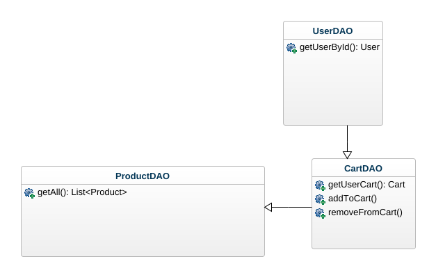
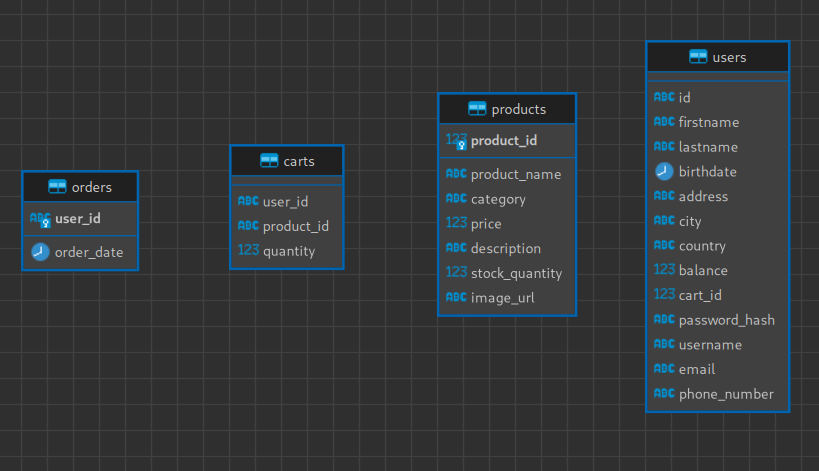
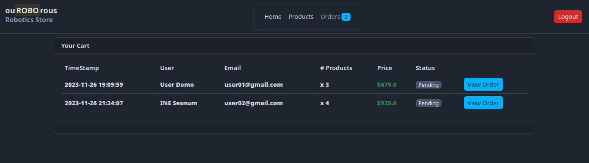
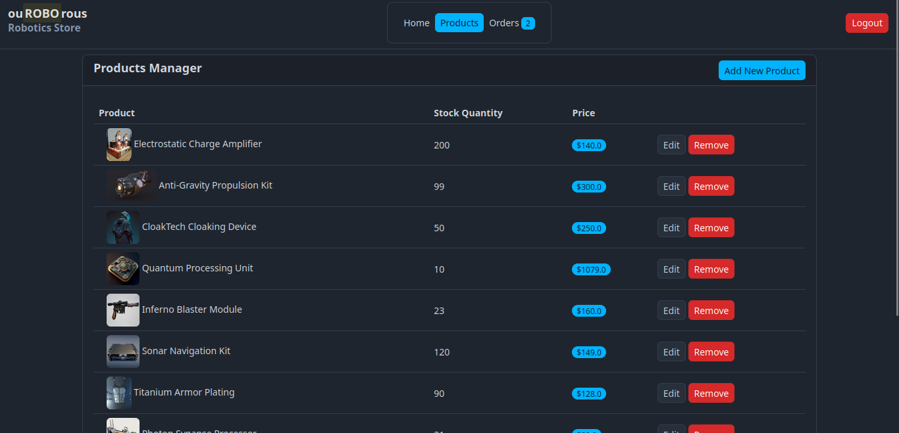
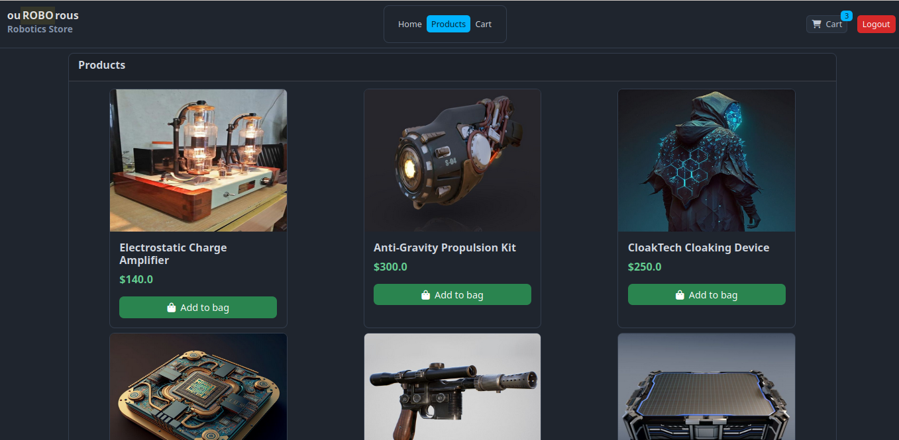
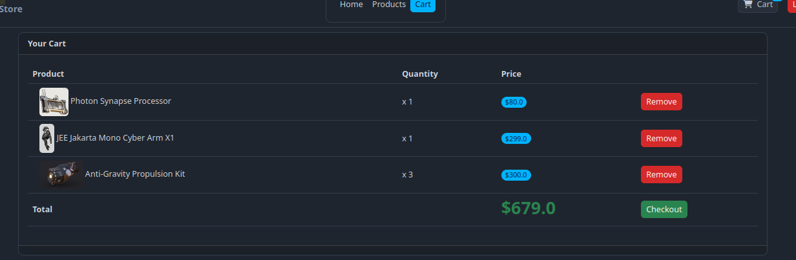
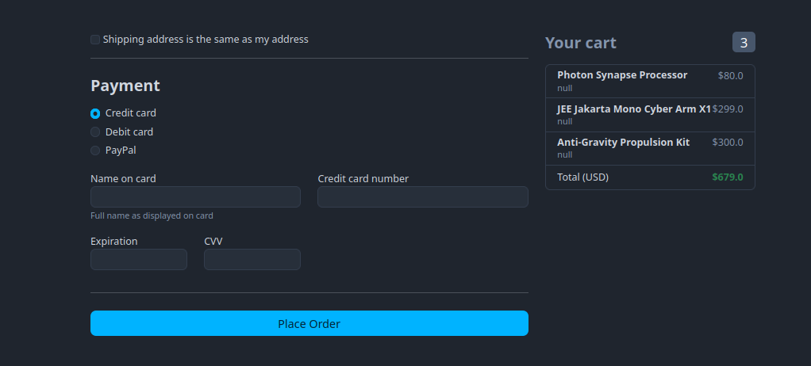
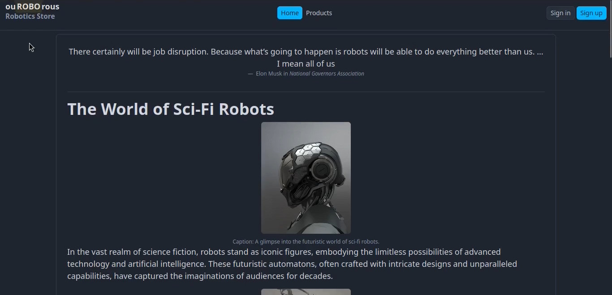

# Project Report: ouROBOrous application

> This web application is a deliverable for an academic project and is being submitted as part of an examination requirement. Developed as a collaborative effort between [ihuomtia](https://github.com/ihuomtia) and [houmez](https://github.com/houmez) within an educational context, it reflects the practical application of learned concepts in software design, web development, and database management. This joint project serves as a demonstration of acquired skills and knowledge from both contributors, showcasing their combined ability to create functional solutions aligned with industry standards.

## Overview
ouROBOrous is designed to provide a seamless shopping experience for users while incorporating robust backend technologies. The project utilizes the Halfmoon CSS framework, which builds on top of Bootstrap, offering enhanced theming and options. JQuery is integral to the project's frontend functionality.

This report is structured as follows:
- [**Introduction**](#overview)
- [**Architecture and Design Patterns**](#architecture-and-design-patterns)
- [**Functionalities**](#functionalities)
- [**Security Measures**](#security-measures)
- [**Technologies Used**](#technologies-used)
- [**Conclusion**](#conclusion)
- [**Future Improvements**](#future-improvements)
- [**Contact Information**](#contact-information)
- [**Demo Video**](#demo-video)

## Architecture and Design Patterns
### Design Patterns
#### Singleton Pattern
ouROBORous application employs the Singleton Pattern to manage database connections efficiently. The `DBSingletonConnection` class ensures a single instance of the database connection is shared across the entire application. This promotes resource optimization and a centralized point for handling database interactions.
#### DAO (Data Access Object) Pattern
The project follows the DAO Pattern to encapsulate database operations in dedicated classes. This modular approach enhances maintainability and readability. Key DAO classes include:
- `UserDAO`: Manages user-related database operations.
- `CartDAO`: Handles shopping cart interactions in the database.
- `ProductDAO`: Facilitates product-related database actions.

### Database Structure
The application's database is structured with multiple tables to organize and store data efficiently:

1. **`users` Table:**
    - Stores user information, including first name, last name, birthdate, address, phone number, and login credentials.
2. **`carts` Table:**
    - Manages user shopping carts, recording the association between user IDs and product IDs along with quantities.
3. **`products` Table:**
    - Contains details about each product, including product ID, name, category, price, description, and stock quantity.
4. **`orders` Table:**
    - Records user orders, capturing order dates and corresponding user IDs.

This relational database structure ensures seamless interactions between different components of the application.

The combination of the Singleton Pattern and DAO Pattern contributes to a scalable and maintainable architecture, fostering code organization and separation of concerns.

## Functionalities
### Administrator Dashboard
#### 1. **Order Management:**
- Administrators have access to a dashboard providing an overview of all orders.
- Orders are displayed with timestamps and associated user IDs.
- The dashboard allows administrators to efficiently track and manage orders.

#### 2. **Product Management:**
- Admins can add new products to the inventory, providing details such as product name, category, price, description, stock quantity, and image URL.
- Existing products can be removed from the inventory.

#### 3. **Dashboard Security:**
- Access to the admin dashboard is restricted to users with administrative privileges.
- Ensures that only authorized personnel can manipulate product listings and view order details.
### User Interactions
#### 1. **Product Catalog:**
- Users can browse a catalog of available products.
- Each product listing includes essential details such as name, category, price, and a brief description.

#### 2. **Shopping Cart Management:**
- Users can add products to their shopping carts, specifying the desired quantity.
- Removal of products from the cart is also supported.
- The application maintains a separate cart for each user, associating products with user IDs.

#### 3. **Order Placement:**
- Users can place orders, capturing the current date and user ID.
- The order is recorded in the `orders` table, creating a history of user transactions.

## Security Measures
### 1. **Password Hashing:**
- User passwords undergo hashing using the MD5 hashing algorithm before storage in the database.
- Hashing adds an additional layer of security by transforming passwords into irreversible, unique hash values.
- This prevents exposure of plain-text passwords, even in the event of a data breach.
### 2. **Secure Database Connection:**
- The application uses the Singleton Pattern through the `DBSingletonConnection` class to manage a single, shared database connection instance.
- Ensures efficient resource utilization and minimizes the risk of database connection leaks.
### 3. **Access Controls:**
- Access to sensitive functionalities, such as the admin dashboard, is restricted based on user roles.
- Only users with administrative privileges can manipulate product listings and view detailed order information.
### 4. **Clean Code and SOLID Principles:**
- Adherence to clean code practices and SOLID principles contributes to a more secure codebase.
- Well-organized, modular code promotes easier code review and reduces the likelihood of introducing vulnerabilities.
### 5. **Database Security:**
- Access controls and permissions are carefully configured to restrict unauthorized access to database resources.
### 6. **Session Management:**
- Session management techniques are employed to control user access and prevent unauthorized sessions.
- User sessions are securely maintained, and sessions are terminated after a defined period of inactivity.
## Technologies Used
### Frontend Technologies:
#### 1. **Halfmoon CSS Framework:**
- Leveraged Halfmoon, a CSS framework built on top of Bootstrap, providing enhanced theming options and extended features.
- Facilitates the creation of a visually appealing and responsive user interface.

#### 2. **JQuery:**
- Implemented JQuery for streamlined DOM manipulation and AJAX requests.
- Enhances the interactivity and responsiveness of the user interface.

### Backend Technologies:
#### 1. **Jakarta EE:**
- Utilized Jakarta EE (Enterprise Edition) for building robust and scalable Java-based enterprise applications.
- Employs features such as servlets and JavaServer Pages (JSP) to handle server-side logic and dynamic content generation.
#### 2. **Java Database Connectivity (JDBC):**
- Employed JDBC to establish a connection between the Java application and the relational database.
- Facilitates the execution of SQL queries and retrieval of data from the database.
#### 3. **Singleton Design Pattern:**
- Applied the Singleton design pattern to ensure a single, shared instance of the database connection.
- Promotes efficient resource utilization and prevents unnecessary overhead.
### Database:
#### 1. **MySQL:**
- MySQL is the chosen relational database for this project.
- Offers robust features for data management, transactions, and relational data modeling.
### Development Practices:
#### 1. **Clean Code and SOLID Principles:**
- Embraced clean code practices to enhance code readability and maintainability.
- Adhered to SOLID principles to create a modular and extensible codebase.
#### 2. **Security Measures:**
- Implemented various security measures, including password hashing, secure database connections, and access controls, to ensure data confidentiality and integrity.
#### 3. **Version Control:**
- Utilized Git for effective collaboration, code tracking, and version management.

## Future Improvements
While the current version of the E-Commerce application successfully meets its objectives, there are several potential areas for future improvements and enhancements. The following points outline possible avenues for further development:
### 1. **Enhanced User Authentication:**
- Implement more advanced user authentication mechanisms, such as multi-factor authentication (MFA), to bolster account security.
### 2. **Personalized User Experience:**
- Introduce features for personalized user experiences, including product recommendations based on user preferences and purchase history.
### 3. **Social Media Integration:**
- Integrate social media authentication and sharing functionalities to enhance user engagement and reach a broader audience.
### 4. **Mobile Application Development:**
- Explore the development of mobile applications for iOS and Android platforms to expand the application's accessibility.
### 5. **Real-time Updates:**
- Implement real-time updates and notifications for users regarding order status, promotions, and product availability.
### 6. **Advanced Analytics:**
- Incorporate advanced analytics and reporting tools to gather insights into user behavior, popular products, and overall system performance.
### 7. **Internationalization and Localization:**
- Extend language support for a more diverse user base by implementing internationalization and localization features.
### 8. **Optimized Database Queries:**
- Fine-tune database queries and indexes to optimize performance, especially as the volume of data grows.
### 9. **Expanded Payment Options:**
- Integrate additional payment gateways and methods to provide users with more choices during the checkout process.
### 10. **Comprehensive Testing:**
- Implement comprehensive testing strategies, including unit testing, integration testing, and user acceptance testing, to ensure the reliability and stability of the application.
### 11. **Accessibility Improvements:**
- Enhance accessibility features to ensure the application is usable by individuals with diverse abilities and disabilities.
### 12. **Scalability Considerations:**
- Evaluate and plan for scalability to accommodate a growing user base and increased data volume.

These proposed improvements aim to elevate the ouROBOrous application by introducing new features, optimizing existing functionalities, and ensuring adaptability to emerging technologies. Prioritization of these enhancements can be determined based on user feedback, market trends, and business requirements.

## Conclusion

In conclusion, ouROBOrous application represents a successful implementation of an online shopping platform that incorporates modern web technologies, follows best practices in software design, and prioritizes security and user experience. Throughout the development process, a robust architecture and design patterns, including the Singleton and DAO patterns, were employed to create a scalable and maintainable system.

The application provides a seamless experience for both administrators and users, with functionalities such as user authentication, product management, and order processing. The use of the Halfmoon CSS framework, built on top of Bootstrap, contributes to an aesthetically pleasing and responsive user interface.

Security measures have been a paramount consideration in the development, with the application adopting industry-standard practices such as password hashing, following clean code principles, and adhering to SOLID design principles. The use of Jakarta EE ensures a robust and scalable backend, while JQuery enhances the frontend interactivity.

Looking ahead, there is room for future improvements, including the implementation of advanced authentication methods, personalization features, and the development of mobile applications. Additionally, considerations for internationalization, scalability, and enhanced analytics could further elevate the application.

In essence, ouROBOrous stands as a testament to effective software engineering practices, delivering a reliable and user-friendly platform for online shopping. As technology continues to evolve, the application provides a solid foundation for adaptation and growth, ensuring its relevance and effectiveness in the dynamic landscape of e-commerce.

## License

This project is open-source and available under the [MIT License](https://opensource.org/licenses/MIT).

## Demo Video
Click on this image to watch the demo:
